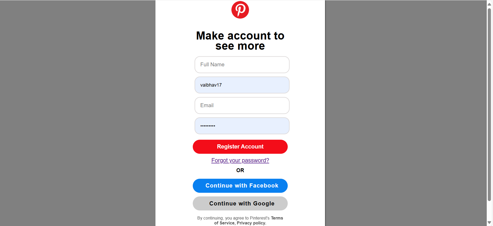

# Pinterest-like Web Application

A full-stack web application inspired by Pinterest, allowing users to register, log in, upload images, and explore a dynamic feed of posts.  
Built with **Node.js**, **Express.js**, **MongoDB**, and **EJS**, the app features secure authentication, responsive design, and interactive UI components.

---

## Features

- **User Authentication**: Secure registration and login using Passport.js with session management.
- **Dynamic Feed**: Displays posts from all users with efficient data retrieval using MongoDB and Mongoose.
- **Image Upload**: Users can upload images with titles and captions using Multer.
- **Interactive UI**: Responsive navigation bar, sidebar, and notification panels built with EJS, CSS, and vanilla JavaScript.
- **Profile Management**: Users can view their profile and manage their posts.

---

## Tech Stack

- **Backend**: Node.js, Express.js
- **Frontend**: EJS, CSS, JavaScript
- **Database**: MongoDB with Mongoose
- **Authentication**: Passport.js
- **File Uploads**: Multer

---

## Installation

1. **Clone the repository:**
    ```bash
    git clone https://github.com/your-username/your-repo-name.git](https://github.com/vaibhav010902/Express.js-Pinterest-like-Web-App.git
    cd Express.js-Pinterest-like-Web-App
    ```

2. **Install dependencies:**
    ```bash
    npm install
    ```

3. **Set up environment variables:**  
   Create a `.env` file in the root directory and add the following:
    ```env
    MONGO_URI=your-mongodb-connection-string
    SESSION_SECRET=your-session-secret
    ```

4. **Start the server:**
    ```bash
    npm start
    ```

5. **Open your browser and navigate to:**
    ```
    http://localhost:3000
    ```

---

## Folder Structure

```
Project/
│
├── routes/                # Application routes
│   ├── index.js            # Main routes
│   ├── users.js            # User-related routes
│   └── post.js             # Post-related routes
│
├── views/                  # EJS templates
│   ├── navbar.ejs          # Navbar partial
│   ├── feed.ejs            # Feed page
│   ├── profile.ejs         # Profile page
│   └── login.ejs           # Login page
│
├── public/                 # Static assets
│   ├── stylesheets/        # CSS files
│   ├── javascripts/        # JavaScript files
│   └── images/             # Uploaded images
│
├── app.js                  # Main application file
├── package.json            # Project metadata and dependencies
└── README.md               # Project documentation
```

---

## Screenshots

<p align="center">
  
  
    
    
    
    
    
    
</p>


---

## License

This project is licensed under the **MIT License**. See the LICENSE file for details.
